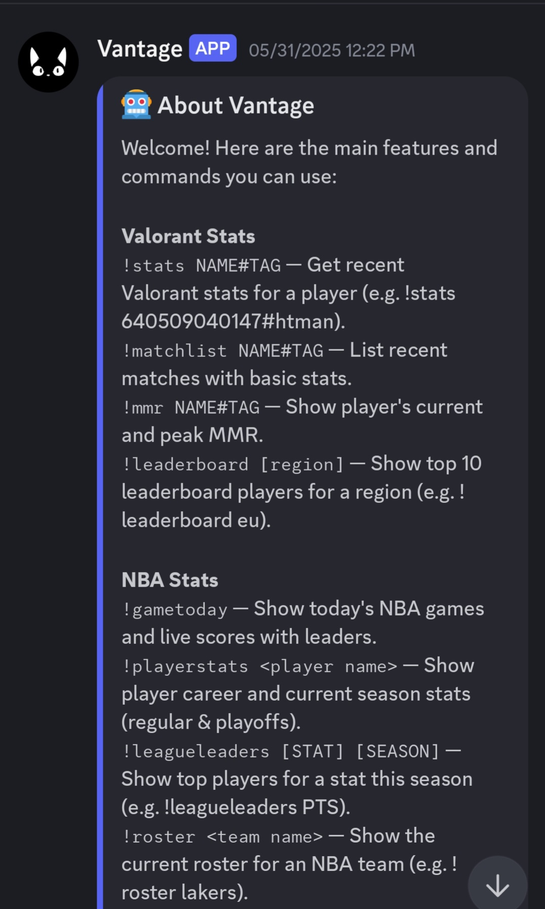

# Vantage

A versatile Discord bot designed for gaming communities and basketball fans — tracks **Valorant stats**, shows **NBA live scores**, handles **music playback**, supports **polls**, and more.

Contact me at dnote@bu.edu for access or deployment inquiries.

---
## 📑 Table of Contents

- [Features](#features)
- [Screenshots](#screenshots)
- [Commands](#commands)
  - [Valorant Commands](#valorant-commands)
  - [NBA Commands](#nba-commands)
  - [Polls](#polls)
  - [Scheduling](#scheduling)
  - [Music](#music)
  - [Bot Info](#bot-info)
- [Built With](#built-with)

## Features

- **Valorant Integration**: Get K/D ratio, headshot %, winrate, and recent match summaries via `valo_api`
- **NBA Stats**: Live scores, player stats, rosters, standings, and league leaders via `nba_api`
- **Polls**: Create interactive, real-time polls with buttons
- **Game Scheduling**: Ping party members with automatic 5-hour reminders
- **Music Player**: YouTube music playback using Wavelink and Lavalink

---

## Screenshots

### Bot Profile  

### !play command  

### !playerstats command  

### !gametoday command  

### !about command  

---

## Commands

### Valorant Commands
| Command | Description |
|--------|-------------|
| `!stats NAME#TAG` | View K/D ratio, headshot %, winrate, and account level |
| `!matchlist NAME#TAG` | List last 5 matches with agent stats |
| `!mmr NAME#TAG` | Show current rank, ELO, and peak rank |
| `!leaderboard [region]` | View top 10 leaderboard players (default: `na`) |

### NBA Commands
| Command | Description |
|---------|-------------|
| `!gametoday` | Show today’s NBA games with scores and stat leaders |
| `!playerstats <player>` | Career and current season stats (regular + playoffs) |
| `!leagueleaders [STAT] [SEASON]` | Top players by stat (e.g., `PTS`, `AST`, `REB`) |
| `!roster <team name>` | Show current team roster |
| `!standings [season] [season_type]` | View conference standings |

### Polls
| Command | Description |
|---------|-------------|
| `!poll question="..." choices="Option 1, Option 2"` | Create a real-time poll with up to 5 choices |

### Scheduling
| Command | Description |
|---------|-------------|
| `!schedule @users YYYY-MM-DD HH:MM` | Schedule a game and get pinged 5 hours before |

### Music
| Command | Description |
|---------|-------------|
| `!play <URL or keywords>` | Play music in your voice channel |
| `!skip` | Skip the current song |
| `!stop` | Stop and disconnect music |

### Bot Info
| Command | Description |
|---------|-------------|
| `!about` | Show bot features and help message |

---

## Built With
- **Python** 3.10
- **discord.py** 2.x
- **Wavelink** (music playback)
- **valo_api** (Valorant data)
- **nba_api** (NBA stats)
- **Lavalink** (hosted audio backend)
- **PebbleHost + Decodo Proxy** (24/7 deployment and NBA API access)
